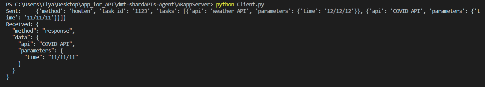

# dmt-shardAPIs-Agent

Принимаю от Юры JSON примерно такого формата:

```python
{
    "method": "howLen",
    "task_id" : "1123",
    "tasks": [
        {
            "api": "weather API",
            "parameters" : {
              "time":"12/12/12"
            }
        },
        {
            "api": "COVID API",
            "parameters" : {
              "time":"11/11/11"
            }
        }
    ]
}
```
В данном случае, "howLen" просто название метода, которым я тестирую возможность разделять JSON сообщение на несколько.

С помощью Client формирую запросы к серверу.

В обработчике запросов создал новый запрос, который идет по отдельным "темам" в графе JSONа "tasks"

```python
elif methodJSON == "howLen":
            msgTasks=msg["tasks"]
            #print(msgLen)
            for json_obj in msgTasks:
                result = FA.one_task(json_obj)
            resultData = result
```
По факту, метод "one_task" - это то, что я буду передавать Антону. Пока там стоит затычка, что я получаю то же самое, что отдаю)))

```python
def one_task(name_task):
    return name_task
```

Вот так формирую ответ. Если честно, то не до конца уверен, что правильно это делаю, но вроде всё работает))

```python
def responseJSON(data):
    """
    Формирует из данных "data" ответ клиенту
    :param data: принимает на вход данные, которые нужно передать тип str с JSON объектом внутри
    :return: сформированное сообщение, готовое к отправке клиенту
    """
    # ------
    # old
    msg = {}
    msg["method"] = "response"
    msg["data"] = data
    msg=json.dumps(msg, indent=2).encode('utf-8')
    file_msg = BytesIO(msg)
    print(msg)
    return file_msg.getvalue()

```


После запуска сервера и запроса от клиента получаю ответ от сервера.


